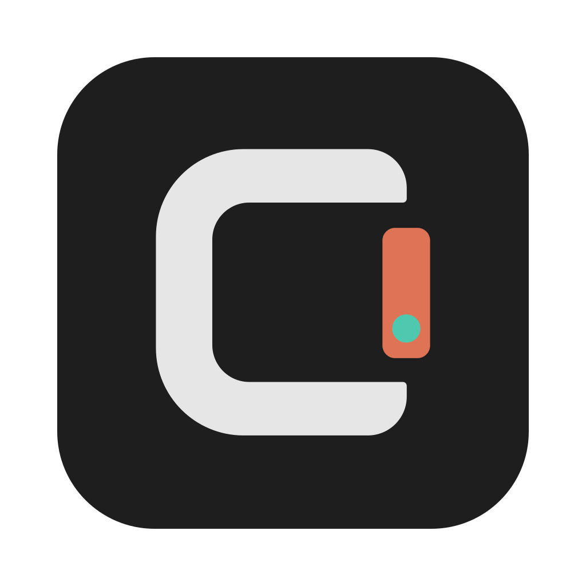

<div align="center">

<picture>
  <source media="(prefers-color-scheme: dark)" srcset="assets/icon/icon-light.svg">
  
</picture>

# Clui

*A local desktop GUI for the Claude Code CLI*

[](https://www.apple.com/mac/)
[](https://www.electronjs.org/)
[](https://react.dev/)
[](https://www.typescriptlang.org/)
[](LICENSE)

[Features](#features) • [Requirements](#requirements) • [Getting Started](#getting-started) • [Building an App](#building-a-local-app) • [How It Works](#how-it-works)

</div>

Clui wraps the `claude` CLI you already have installed and gives it a native desktop interface — multiple live sessions, a live model and effort picker, per-session permission modes, conversation search, image attachments, and light/dark themes — all driving the real CLI underneath.

It never modifies your `~/.claude/settings.json`. Every model, effort, and permission choice is per-session and stored in Clui's own app-data directory, so the CLI you use in the terminal is left exactly as it was.

> [!NOTE]
> Clui is built and tested for **macOS on Apple Silicon (arm64)**. The packaging config and a few native integrations target macOS; it may run elsewhere with adjustments, but that isn't supported yet.

## Features

- **Multiple live sessions** — each keeps its own `claude` process alive in the background. Switching is instant, and in-flight turns keep streaming across a switch.
- **Live model & effort selection** — the model list is fetched live from your provider; effort switches mid-session without losing context.
- **Per-session permission modes** — Interactive, Auto Edit, Plan, and Autonomous, changeable mid-session, with an approval dialog for every tool use.
- **Conversation search** — find within a conversation (`⌘F`) or search across every session at once (`⌘⇧F`).
- **Attachments** — paste, drag-drop, or attach images and files directly into a turn.
- **Subagent & workflow visibility** — nested agent transcripts and a live workflow progress tree.
- **Built for reading** — markdown with syntax highlighting, a command palette (`⌘K`), slash-command and `@`-file autocomplete, session export, and full light/dark theming.

## Requirements

| Requirement | Notes |
| ----------- | ----- |
| **macOS on Apple Silicon** | The build target is `mac / arm64`. |
| **Node.js 22.12+** | Vite 7 and electron-vite 5 both require it. Developed on 24.18.0 |
| **npm 9+** | Ships with Node. Developed on npm 11. |
| **The `claude` CLI** | Install [Claude Code](https://claude.com/claude-code), and make sure `claude --version` works **and that you are logged in**. Clui drives the CLI already on your machine — it does not ship or install it. |

## Getting Started

Fork the repository to your account (or clone it directly to build locally), then:

```bash
git clone https://github.com/<your-username>/clui.git
cd clui
npm install
npm run dev
```

`npm run dev` launches Clui with hot reload. On first run, make sure the `claude` CLI is authenticated in your terminal — Clui inherits that auth.

> [!WARNING]
> **npm blocks post-install scripts by default.** Electron and esbuild download their binaries in a post-install step, so a fresh `npm install` can silently skip them. This repo commits an allowlist (the `allowScripts` field in `package.json`), so a normal install should just work.
>
> If the app fails to launch with a missing-Electron-binary error, approve the scripts and reinstall:
>
> ```bash
> npm approve-scripts electron esbuild
> npm install
> ```

## Building a Local App

To produce a runnable `.app` bundle:

```bash
npm run package
```

The app lands at `release/mac-arm64/Clui.app`. Open it from Finder, or:

```bash
open release/mac-arm64/Clui.app
```

> [!WARNING]
> **The app is unsigned.** With no Apple Developer code-signing set up, macOS Gatekeeper refuses to open it on the first try. Since you built it yourself, you can allow it in one of two ways:
>
> - **Right-click** the app → **Open** → **Open**, or
> - clear the quarantine flag: `xattr -dr com.apple.quarantine release/mac-arm64/Clui.app`
>
> Only do this for apps you built or trust.

## Scripts

| Command | Description |
| ------- | ----------- |
| `npm run dev` | Launch the app with hot reload |
| `npm run build` | Type-check and build to `out/` |
| `npm run typecheck` | Run `tsc -b --noEmit` |
| `npm run package` | Build an unpackaged `.app` into `release/` |
| `npm run dist` | Build a distributable |

## How It Works

Clui is split cleanly between processes:

- The **main process** owns the CLI subprocesses (one per live session), IPC, and the native window.
- The **renderer** is pure UI — a Zustand store with a single persistent event subscription. Switching sessions only changes which slice is active, which is why background sessions keep streaming.

Clui speaks to the `claude` CLI over its duplex `stream-json` protocol, and over the stdio control protocol for interactive tool approval.

```
src/
  main/       Electron main — CLI subprocess management, IPC, sessions
  preload/    Context-isolated bridge (emitted as index.cjs)
  renderer/   React + Tailwind UI (Zustand store, components)
  shared/     Types shared across processes
build/        App icon (icon.icns) used by electron-builder
assets/       Icon source SVGs
```

## Troubleshooting

- **"Not logged in · run /login" in every session** — the `claude` CLI isn't authenticated in the environment Clui launched from. Confirm `claude` works from your terminal, then relaunch Clui.
- **App won't launch after `npm install`** — approve the post-install scripts (see the install warning above), then reinstall.
- **Gatekeeper blocks the packaged app** — see the unsigned-app warning above.
- **Type or build errors after pulling changes** — run `npm install` again, then `npm run typecheck`.

> [!TIP]
> Issues and pull requests are welcome. Please run `npm run typecheck` and `npm run build` before opening a PR.

---

<div align="center">
<sub>Released under the MIT License. Built with Electron, React, and TypeScript.</sub>
</div>
